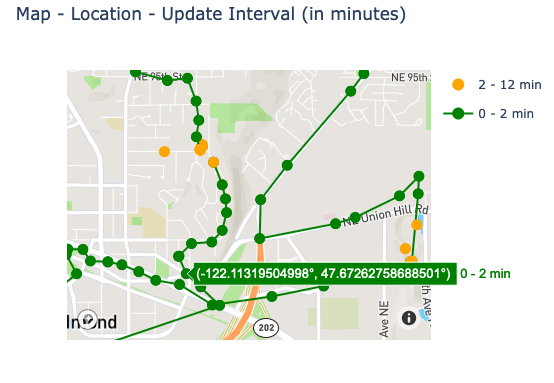
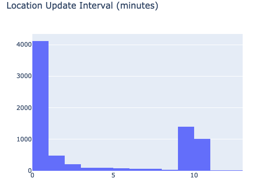
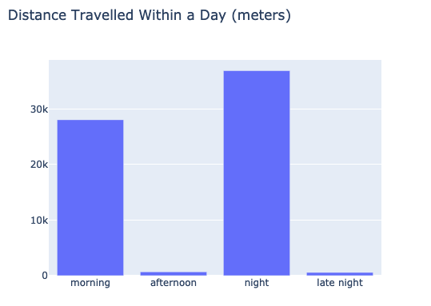
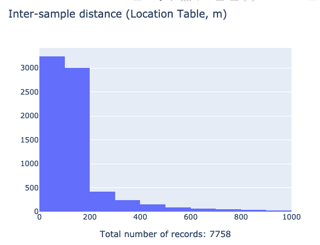
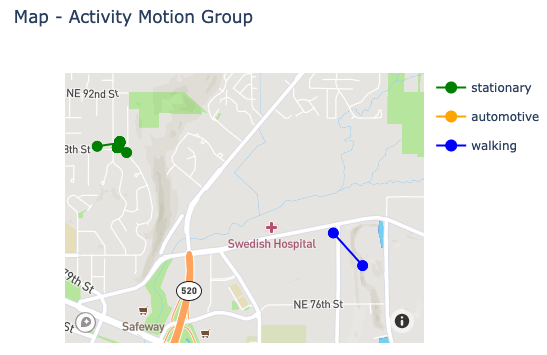
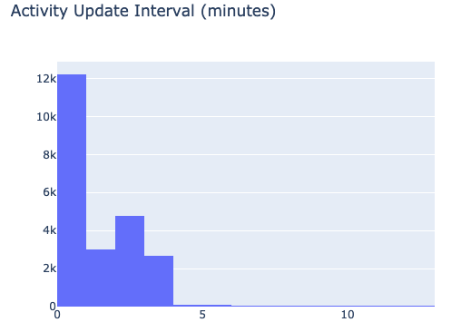
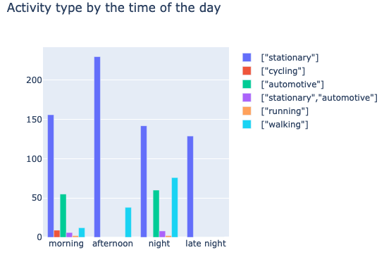
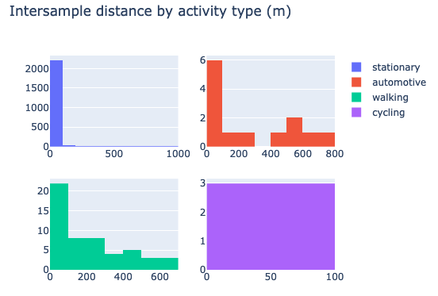

# AWARE-visualized

Analysis of Aware-Android's location collection. Aim to find the difference between indoor & outdoor collection: quantity, quality. 

### How to deploy locally

1. Pull the repo. 
2. Prepare a `connection_details.json` in the following format.  

    ```json
    {
      "host": "YOUR_MYSQL_HOST",
      "database": "YOUR_DB_NAME",
      "user": "YOUR_USER_NAME",
      "password": "YOUR_PASSWORD"
    }
    ```
   
3. Replace the file paths in `display_panel_pipeline.py`. 

4. Run `python flask_interface.py false`. The `false` keyword means we don't use the cache mode. 
(Please don't use the cache mode right now - it hasn't been modified to support the latest features)

### All interactive graph screenshots

#### Location graphs

Location update intervals: this shows the intervals between two consecutive location data points. Previous research shows that when the participant is indoor, AWARE only collections location roughly once per 10 minutes. This graph supports panning and zooming. When the cursor hovers over the data points, the lat and long info is shown. 



This shows the histogram for the update interval. This shows that most consecutive data points have an update interval within 2 minutes. 



This shows a bar chart of distance travelled within a day. Morning: 6AM - 12PM. Afternoon: 12PM - 6PM. Night: 6PM - 12AM. Late night: 12AM - 6AM. 



This shows the inter-sample distance between two consecutive data points. This shows that most data points are recorded within 200 meters of distance.




#### Activity graphs

This is a map graph for the activities. While the actual list of activities have more types of motion, only the most prominent 3 are displayed. (This can, of course, be changed later. )



This is a histogram of the activity update intervals. This shows that most activity are updated within 2 minutes. 



This is a grouped bar chart showing the activity type by the time of the day. It shows the participant used cars in the morning and at night. 



Finally this is a chart showing inter-sample distance by activity type. Stationary data points have a "distance" within 100 meters, which is rather accurate considering GPS drifting. 

